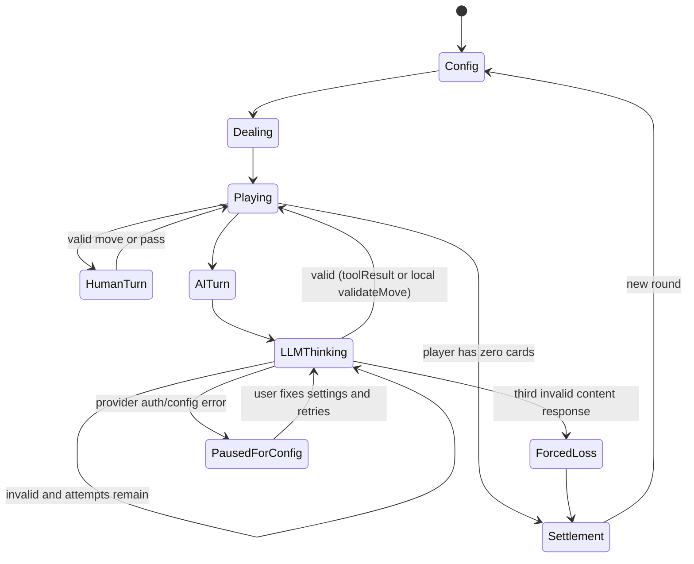

## Acceptance Test Document — 3D AI Doudizhu Game

> **How to use:** Follow each test case step by step. Mark each as PASS or FAIL.  
> **Prerequisites:** The implementation is complete, dependencies are installed, and the game has been built at least once. For real-provider tests, prepare one valid DeepSeek API Key and one valid Spark MaaS API Key. If real keys are not available, mark real-provider cases as BLOCKED and run mock-provider cases instead.

### TC-01 Game Lobby Shows AI Doudizhu Entry

| Item | Content |
|------|---------|
| **Route** | `/games/` |
| **Steps** | 1. Run the Astro dev server or preview server. 2. Navigate to `/games/`. 3. Find the game cards grid. 4. Look for the AI 斗地主 game card. |
| **Expected** | A new game card is visible for AI 斗地主 or equivalent title. The card description mentions LLM/AI players or 3D 斗地主. The card link points to `/games/doudizhu-ai/`. |
| **Notes** | This verifies Astro lobby integration only, not game functionality. |

---

### TC-02 Game Route Loads 3D Scene

| Item | Content |
|------|---------|
| **Route** | `/games/doudizhu-ai/` |
| **Steps** | 1. Build the game sub-project. 2. Start the Astro preview or dev server. 3. Navigate to `/games/doudizhu-ai/`. 4. Observe the page content. |
| **Expected** | The page loads without a 404. A cyber-style dark 3D scene appears with a hologram table area or loading state that resolves to the table. The pre-game configuration panel is visible. |
| **Notes** | If the game route is blank, check whether `public/games/doudizhu-ai/index.html` was generated. |

---

### TC-03 Configuration Blocks Missing API Keys

| Item | Content |
|------|---------|
| **Route** | `/games/doudizhu-ai/` |
| **Steps** | 1. Navigate to `/games/doudizhu-ai/`. 2. Leave both AI API Key fields empty. 3. Click the start game button. |
| **Expected** | The game does not start. A visible validation message says both AI players require API keys or equivalent. No cards are dealt. |
| **Notes** | This should happen before any `/api/llm` call. |

---

### TC-04 Configuration Accepts Two Providers

| Item | Content |
|------|---------|
| **Route** | `/games/doudizhu-ai/` |
| **Steps** | 1. Navigate to `/games/doudizhu-ai/`. 2. Set AI 1 provider to DeepSeek. 3. Set AI 2 provider to Spark MaaS. 4. Enter non-empty API Key values for both. 5. Keep proxy URL as `/api/llm`. 6. Click start game. |
| **Expected** | The configuration panel closes or changes to gameplay mode. The game deals cards and displays each player's role or landlord/farmer status. |
| **Notes** | Dummy keys may allow the game to start, but the first real AI turn should later pause for auth failure. |

---

### TC-05 API Keys Are Not Saved By Default

| Item | Content |
|------|---------|
| **Route** | `/games/doudizhu-ai/` |
| **Steps** | 1. Open `/games/doudizhu-ai/`. 2. Enter API keys for both AI players. 3. Ensure both remember-key checkboxes are unchecked. 4. Refresh the browser page. 5. Inspect the API Key fields. |
| **Expected** | API Key fields are empty after refresh. Non-secret settings such as selected providers or model names may remain saved. |
| **Notes** | This verifies the default in-memory-only key behavior. |

---

### TC-06 API Keys Save Only After Opt-In

| Item | Content |
|------|---------|
| **Route** | `/games/doudizhu-ai/` |
| **Steps** | 1. Open `/games/doudizhu-ai/`. 2. Enter API keys for both AI players. 3. Check the remember-key checkbox for AI 1 only. 4. Leave AI 2 remember-key unchecked. 5. Refresh the page. 6. Inspect both API Key fields. |
| **Expected** | AI 1's API Key is restored from localStorage. AI 2's API Key is empty. A risk notice explains that saved keys are stored only in this local browser. |
| **Notes** | Clear site data after this test if using real keys. |

---

### TC-07 New Round Deals Correctly and Random Landlord Receives Bottom Cards

| Item | Content |
|------|---------|
| **Route** | `/games/doudizhu-ai/` |
| **Steps** | 1. Configure both AI players with valid or mock-compatible settings. 2. Start a new game. 3. Observe the player card counts and landlord marker. 4. Start several new rounds if the UI allows. |
| **Expected** | Exactly one player is marked landlord. The landlord has 20 cards at the start, and both farmers have 17 cards. The bottom-card area is shown and associated with the landlord. The landlord may vary between rounds. |
| **Notes** | Randomness means the landlord does not need to change every round, but must always be exactly one valid player. |

---

### TC-08 Human Can Select and Deselect Cards

| Item | Content |
|------|---------|
| **Route** | `/games/doudizhu-ai/` |
| **Steps** | 1. Start a game. 2. Wait until it is the human player's turn, or start new rounds until human is landlord if necessary. 3. Click one card in the human hand. 4. Click the same card again. |
| **Expected** | On first click, the card visually lifts or glows to show selection. On second click, it returns to unselected state. |
| **Notes** | If it is not the human turn, selection may be disabled; the UI should make current turn clear. |

---

### TC-09 Human Invalid Move Is Rejected Locally

| Item | Content |
|------|---------|
| **Route** | `/games/doudizhu-ai/` |
| **Steps** | 1. Start a game and wait for a human turn where another player has an active previous move. 2. Select cards that do not form a valid hand or cannot beat the previous move. 3. Click `出牌`. |
| **Expected** | The selected cards remain in the human hand. A visible error explains why the move is illegal, such as invalid hand pattern or cannot beat the previous move. The turn does not advance. |
| **Notes** | This validates local `validateMove`; no LLM call should be made for human moves. |

---

### TC-10 Human Valid Move Advances Turn

| Item | Content |
|------|---------|
| **Route** | `/games/doudizhu-ai/` |
| **Steps** | 1. Start a game and wait for a human turn. 2. Select a legal hand, such as a single card when leading a trick. 3. Click `出牌`. 4. Observe the central play area and current turn indicator. |
| **Expected** | The selected cards leave the human hand and appear in the central play area. The human remaining-card count decreases. The current turn advances to the next player. |
| **Notes** | Use a simple legal move for the first validation pass. |

---

### TC-11 Pass Button Is Disabled When Leading

| Item | Content |
|------|---------|
| **Route** | `/games/doudizhu-ai/` |
| **Steps** | 1. Start a game. 2. Wait until the human player is the current trick leader. 3. Observe the `跳过` button. 4. Try to click it if it is clickable. |
| **Expected** | The pass button is disabled or clicking it shows a validation error. The game state does not advance due to a leading pass. |
| **Notes** | The landlord's first turn is always a leading turn. |

---

### TC-12 Pass Is Allowed When Following

| Item | Content |
|------|---------|
| **Route** | `/games/doudizhu-ai/` |
| **Steps** | 1. Start a game. 2. Wait until another player has played a previous move and it is the human player's turn to follow. 3. Click `跳过`. |
| **Expected** | The human turn is passed. The central previous move remains unchanged. The current turn advances to the next player. |
| **Notes** | If no previous move exists, use TC-11 instead. |

---

### TC-13 Two Passes Reset Trick Leader

| Item | Content |
|------|---------|
| **Route** | `/games/doudizhu-ai/` |
| **Steps** | 1. Start a game with mock AI or a controllable test mode. 2. Have one player play a valid hand. 3. Have the next two players pass. 4. Observe the next current player. |
| **Expected** | The player who made the previous active move becomes the new trick leader. The UI allows that player to lead any valid hand instead of needing to beat the old move. |
| **Notes** | This is easiest with a mock/test mode that can force AI passes. |

---

### TC-14 Bomb or Rocket Updates Multiplier

| Item | Content |
|------|---------|
| **Route** | `/games/doudizhu-ai/` |
| **Steps** | 1. Start a game using a test deal or mock setup that gives a player a bomb or rocket. 2. Play the bomb or rocket legally. 3. Observe the multiplier display and visual effect. |
| **Expected** | The multiplier doubles immediately after the bomb or rocket is played. A distinct cyber visual effect appears in the central table area. |
| **Notes** | If no test-deal mode exists, this case may require repeated rounds until a bomb/rocket appears. |

---

### TC-15 Round Ends When Any Player Has No Cards

| Item | Content |
|------|---------|
| **Route** | `/games/doudizhu-ai/` |
| **Steps** | 1. Play a round until any player has zero cards, or use a test state near round end. 2. Observe the transition after the final move. |
| **Expected** | Gameplay stops immediately. A settlement modal appears. It identifies landlord or farmers as winners based on which player emptied their hand. |
| **Notes** | A farmer emptying their hand means both farmers win. |

---

### TC-16 Settlement Uses Multiplier Scoring

| Item | Content |
|------|---------|
| **Route** | `/games/doudizhu-ai/` |
| **Steps** | 1. Complete a round with known winner and known multiplier. 2. Open the settlement modal. 3. Compare score deltas to the formula in the design spec. |
| **Expected** | If landlord wins, landlord gets `+2 * multiplier` and each farmer gets `-1 * multiplier`. If farmers win, landlord gets `-2 * multiplier` and each farmer gets `+1 * multiplier`. |
| **Notes** | The modal should also show final multiplier. |

---

### TC-17 DeepSeek AI Decision Succeeds

| Item | Content |
|------|---------|
| **Route** | `/games/doudizhu-ai/` |
| **Steps** | 1. Configure one or both AI players with provider DeepSeek and a valid DeepSeek API Key. 2. Start a game. 3. Wait until a DeepSeek-backed AI player's turn. 4. Observe LLM status, move result, and AI speech. |
| **Expected** | The HUD shows thinking or equivalent status. The AI eventually plays or passes legally. The move appears in the game state, and a short Chinese persona speech appears near the AI. |
| **Notes** | If the key is missing, invalid, or out of balance, run TC-19 instead. |

---

### TC-18 Spark MaaS AI Decision Succeeds

| Item | Content |
|------|---------|
| **Route** | `/games/doudizhu-ai/` |
| **Steps** | 1. Configure one or both AI players with provider Spark MaaS and a valid Spark MaaS API Key. 2. Start a game. 3. Wait until a Spark-backed AI player's turn. 4. Observe LLM status, move result, and AI speech. |
| **Expected** | The HUD shows thinking or equivalent status. The AI eventually plays or passes legally. The move appears in the game state, and a short Chinese persona speech appears near the AI. |
| **Notes** | If Spark MaaS model naming differs by account, use the model input field to enter the account-supported model. |

---

### TC-19 Provider Auth Failure Pauses Instead of Forcing Loss

| Item | Content |
|------|---------|
| **Route** | `/games/doudizhu-ai/` |
| **Steps** | 1. Configure an AI player with an invalid API Key. 2. Start a game. 3. Wait until that AI player's turn. 4. Observe the UI after the provider returns an auth error. |
| **Expected** | The game pauses and displays a clear message asking the user to check the key or provider configuration. The AI side is not immediately declared loser. The user can update settings and retry the current AI turn. |
| **Notes** | Auth/config errors are different from invalid LLM content. |

---

### TC-20 Invalid LLM Tool Output Retries and Then Forces Loss

| Item | Content |
|------|---------|
| **Route** | `/games/doudizhu-ai/` |
| **Steps** | 1. Enable a mock/test provider that returns invalid JSON or illegal card choices. 2. Start a game. 3. Wait until the affected AI turn. 4. Observe the retry status after each invalid response. 5. Wait for the third invalid content attempt. |
| **Expected** | The game performs validation after each response and feeds the error into the retry prompt. After three invalid content attempts, the AI player's side is declared loser. The settlement modal explains the forced-loss reason. |
| **Notes** | This test should not use real keys unless a safe prompt or debug mode can force invalid output. |

---

### TC-21 AI Cannot Play Cards It Does Not Own

| Item | Content |
|------|---------|
| **Route** | `/games/doudizhu-ai/` |
| **Steps** | 1. Enable a mock/test provider that returns a `validateMove` call with a card not in the AI hand. 2. Start or resume an AI turn. 3. Observe validation and retry behavior. |
| **Expected** | The move is rejected with a `CARD_NOT_OWNED`-style message. The card is not removed from any hand. The validation error is included in the next LLM retry context. |
| **Notes** | This verifies the local tool is authoritative over LLM output. |

---

### TC-22 Proxy Endpoint Rejects Invalid Request Body

| Item | Content |
|------|---------|
| **Route** | `/api/llm` |
| **Steps** | 1. Send a `POST` request to `/api/llm` with an empty JSON object. 2. Inspect the JSON response. |
| **Expected** | The response is a normalized failure object with `ok: false` and an error code/message explaining missing provider, API key, model, or messages. The response must not include any secret. |
| **Notes** | This can be tested with browser dev tools, curl, or an API client. |

---

### TC-23 Proxy Endpoint Rejects Unsupported Provider

| Item | Content |
|------|---------|
| **Route** | `/api/llm` |
| **Steps** | 1. Send a `POST` request to `/api/llm` with provider set to an unsupported value. 2. Include dummy non-empty values for other required fields. 3. Inspect the JSON response. |
| **Expected** | The response is a normalized failure object with `ok: false` and a provider-not-supported error. No upstream provider call is made. |
| **Notes** | This verifies provider allow-list behavior. |

---

### TC-24 Build Game Sub-project

| Item | Content |
|------|---------|
| **Route** | N/A |
| **Steps** | 1. From `games/doudizhu-ai`, run the typecheck command. 2. Run the test command. 3. Run the build command. 4. Check generated output. |
| **Expected** | Typecheck passes. Unit tests pass. Build succeeds. `public/games/doudizhu-ai/index.html` exists and is ignored by git. |
| **Notes** | This should be run before root build. |

---

### TC-25 Root Build Succeeds

| Item | Content |
|------|---------|
| **Route** | N/A |
| **Steps** | 1. From the project root, run `npm run build`. 2. Wait for all game builds and Astro build to complete. 3. Inspect the command result. |
| **Expected** | Root build completes successfully. Both `green-cycle` and `doudizhu-ai` game builds run before Astro. The final `dist/` output is generated. |
| **Notes** | Required before finishing non-trivial changes per project rules. |

---

## Appendix A: Route Summary

| Route | Purpose |
|-------|---------|
| `/games/` | Astro game lobby with the new AI 斗地主 card. |
| `/games/doudizhu-ai/` | Built static game entry. |
| `/api/llm` | Cloudflare Pages Function for LLM proxy calls. |

## Appendix B: Status Flow

## Appendix C: Provider and Error Summary

| Provider ID | Display Name | Expected Behavior |
|-------------|--------------|-------------------|
| `deepseek` | DeepSeek | Calls DeepSeek-compatible chat endpoint through `/api/llm`. |
| `spark-maas` | 星火 MaaS | Calls Spark MaaS chat endpoint through `/api/llm`. |

| Error Category | Counts Toward 3 Invalid Attempts? | Expected Handling |
|----------------|----------------------------------|-------------------|
| Missing API key before start | No | Block start and show validation. |
| Provider auth failure | No | Pause game and ask user to fix key. |
| Provider balance/limit/model issue | No | Pause game and show provider error. |
| Network failure | No, unless implementation explicitly treats repeated transient failure as retryable status | Show retry/pause state. |
| Non-JSON LLM response | Yes | Retry with parse error context. |
| Wrong tool name | Yes | Retry with schema error context. |
| Card not owned | Yes | Retry with validation error context. |
| Illegal hand pattern | Yes | Retry with validation error context. |
| Cannot beat previous move | Yes | Retry with validation error context. |
| Pass while leading | Yes | Retry with validation error context. |
