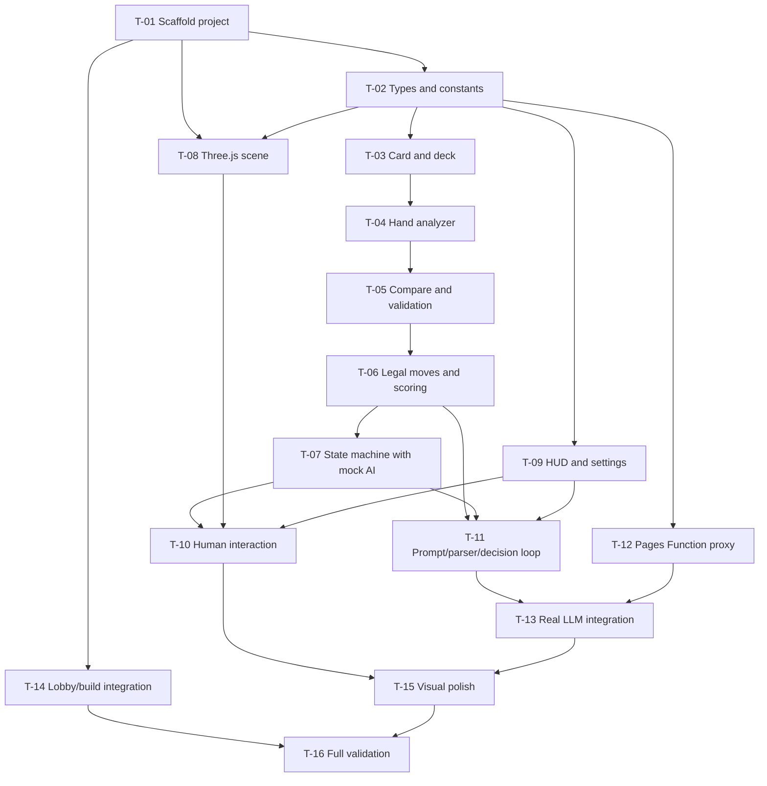

## Development Task Breakdown — 3D AI Doudizhu Game

> Prerequisites: Read `CLAUDE.md` for project context. Refer to `docs/changes.md` for scope and `docs/superpowers/specs/2026-06-30-doudizhu-ai-design.md` for the approved design.

### T-01 Scaffold the `doudizhu-ai` Vite Game Project

**Priority:** P0  
**Status:** 🟢 pure frontend  
**Depends on:** None

**Content:** Create the new built-game sub-project under `games/doudizhu-ai/` with TypeScript, Vite, Three.js, Vitest, and single-file build output to `public/games/doudizhu-ai/`.

**Implementation guidance:**
- Create `games/doudizhu-ai/package.json` following the command style of `games/green-cycle/package.json`.
- Include scripts for dev, build, preview, typecheck, and test.
- Create `games/doudizhu-ai/tsconfig.json` with strict TypeScript settings appropriate for browser code.
- Create `games/doudizhu-ai/vite.config.ts` with output directory set to `../../public/games/doudizhu-ai/` and single-file bundling enabled.
- Create `games/doudizhu-ai/index.html` with separate root elements for the 3D canvas and DOM HUD.
- Add `games/doudizhu-ai/CLAUDE.md` documenting project-specific commands and architecture boundaries.

**Verification:**
- Running the game sub-project dev command starts a Vite server.
- Running the game sub-project build command creates `public/games/doudizhu-ai/index.html`.
- No generated files under `public/games/doudizhu-ai/` appear as tracked changes.

**Files involved:**
- `games/doudizhu-ai/package.json`
- `games/doudizhu-ai/tsconfig.json`
- `games/doudizhu-ai/vite.config.ts`
- `games/doudizhu-ai/index.html`
- `games/doudizhu-ai/CLAUDE.md`

---

### T-02 Define Shared Types and Game Constants

**Priority:** P0  
**Status:** 🟢 pure frontend  
**Depends on:** T-01

**Content:** Establish the shared type vocabulary for cards, players, roles, moves, game phases, LLM providers, and settings.

**Implementation guidance:**
- In `games/doudizhu-ai/src/types.ts`, define player IDs for the human player and two AI players, landlord/farmer roles, play/pass actions, move proposals, validation results, and normalized LLM request/response types.
- In `games/doudizhu-ai/src/config.ts`, define default model names for DeepSeek and Spark MaaS, default proxy URL `/api/llm`, maximum AI validation attempts of 3, speech length limit, initial base score, and initial multiplier.
- Keep these files dependency-light so all modules can import them without circular dependencies.

**Verification:**
- Typecheck passes after imports are added in later tasks.
- Constants match the design spec: two providers, 3 max validation attempts, default proxy URL `/api/llm`.

**Files involved:**
- `games/doudizhu-ai/src/types.ts`
- `games/doudizhu-ai/src/config.ts`

---

### T-03 Implement Card, Deck, and Dealing Rules

**Priority:** P0  
**Status:** 🟢 pure frontend  
**Depends on:** T-02

**Content:** Implement deterministic card representation, ordering, full deck creation, shuffle, deal, random landlord assignment, and bottom-card assignment.

**Implementation guidance:**
- In `src/rules/card.ts`, define card IDs such as spades/hearts/clubs/diamonds plus black/red joker, display labels, rank order, and sorting helpers.
- In `src/rules/deck.ts`, create a 54-card deck, shuffle it, deal 17 cards to each player, choose a random landlord, and assign 3 bottom cards to the landlord.
- Ensure each card ID is unique and serializable for LLM prompts.
- Keep all functions pure except the random shuffle entry point; allow injecting a random function for tests.

**Verification:**
- A dealt game always contains 54 unique cards.
- Two non-landlord players receive 17 cards and the landlord receives 20 cards.
- The landlord is one of the three valid player IDs.

**Files involved:**
- `games/doudizhu-ai/src/rules/card.ts`
- `games/doudizhu-ai/src/rules/deck.ts`
- `games/doudizhu-ai/tests/deck.test.ts` if added

---

### T-04 Implement Hand Pattern Recognition

**Priority:** P0  
**Status:** 🟢 pure frontend  
**Depends on:** T-03

**Content:** Recognize all MVP-supported Doudizhu hand patterns as pure rule logic.

**Implementation guidance:**
- In `src/rules/handAnalyzer.ts`, identify single, pair, triple, triple-with-single, triple-with-pair, straight, consecutive pairs, airplane, airplane-with-singles, airplane-with-pairs, four-with-two, bomb, and rocket.
- Reject invalid combinations clearly, including invalid straights containing 2 or jokers.
- Return structured pattern data that includes type, primary rank, length where relevant, and multiplier effect where relevant.
- Keep pattern naming consistent with `moveValidator` and `compare`.

**Verification:**
- `games/doudizhu-ai/tests/handAnalyzer.test.ts` covers every supported pattern with positive and negative examples.
- Invalid combinations return invalid pattern data rather than throwing.

**Files involved:**
- `games/doudizhu-ai/src/rules/handAnalyzer.ts`
- `games/doudizhu-ai/tests/handAnalyzer.test.ts`

---

### T-05 Implement Hand Comparison and Move Validation

**Priority:** P0  
**Status:** 🟢 pure frontend  
**Depends on:** T-04

**Content:** Implement the local `validateMove` tool that is the single source of truth for human and AI actions.

**Implementation guidance:**
- In `src/rules/compare.ts`, compare same-pattern moves, bomb precedence, and rocket precedence.
- In `src/rules/moveValidator.ts`, validate ownership, current turn, pass eligibility, pattern legality, and whether a move can beat the previous active move.
- Return structured error codes and Chinese messages for UI display and LLM retry prompts.
- Ensure leading a new trick with `pass` is invalid.
- Ensure following a previous move can use `pass` or a valid stronger move.

**Verification:**
- `compare.test.ts` covers ordinary comparisons, bombs, rocket, and incompatible ordinary patterns.
- `moveValidator.test.ts` covers card ownership, invalid cards, invalid pass, valid pass, unable-to-beat, and valid beat.

**Files involved:**
- `games/doudizhu-ai/src/rules/compare.ts`
- `games/doudizhu-ai/src/rules/moveValidator.ts`
- `games/doudizhu-ai/tests/compare.test.ts`
- `games/doudizhu-ai/tests/moveValidator.test.ts`

---

### T-06 Implement Legal Move Generation and Scoring

**Priority:** P0  
**Status:** 🟢 pure frontend  
**Depends on:** T-05

**Content:** Generate legal action hints for AI prompts and compute multiplier-based settlement.

**Implementation guidance:**
- In `src/rules/legalMoveGenerator.ts`, generate a practical set of legal actions from the current hand and previous move, including pass when allowed.
- Cap or summarize large candidate lists so prompts remain compact.
- In `src/rules/scoring.ts`, track multiplier changes from bombs and rockets and compute landlord/farmer score deltas.
- Use the design spec’s scoring formula exactly.

**Verification:**
- Legal move generation includes pass only when allowed.
- Legal move hints never include cards outside the current AI hand.
- `scoring.test.ts` verifies landlord win, farmer win, one bomb, multiple bombs, and rocket multiplier behavior.

**Files involved:**
- `games/doudizhu-ai/src/rules/legalMoveGenerator.ts`
- `games/doudizhu-ai/src/rules/scoring.ts`
- `games/doudizhu-ai/tests/scoring.test.ts`

---

### T-07 Implement Game State, State Machine, and Turn Flow with Mock AI

**Priority:** P0  
**Status:** 🟢 pure frontend  
**Depends on:** T-06

**Content:** Create a playable non-LLM single-round loop using local state and mock AI decisions.

**Implementation guidance:**
- In `src/game/state.ts`, define initial state creation, player setup, landlord assignment, utility functions (`createNewRound`, `getNextPlayerId`, `getAwaitingPhase`).
- In `src/game/turnFlow.ts`, apply validated moves, remove played cards, update previous move, advance turn, reset trick after two passes, update multiplier, and detect winner.
- In `src/main.ts`, orchestrate start round, human action entry points, AI action entry points, and render/UI updates (using `AppModel` rather than a dedicated `Game` class).
- Use a mock AI that selects a legal action from `legalMoveGenerator` so the game can run before LLM integration.

**Verification:**
- A round can start, progress through multiple turns, and end when a player has no cards.
- Invalid human moves do not mutate state.
- Two consecutive passes return lead to the previous move owner.
- Bomb and rocket moves update multiplier.

**Files involved:**
- `games/doudizhu-ai/src/game/state.ts`
- `games/doudizhu-ai/src/game/turnFlow.ts`
- `games/doudizhu-ai/src/main.ts`

---

### T-08 Build the Basic Three.js Cyber Hologram Scene

**Priority:** P1  
**Status:** 🟢 pure frontend  
**Depends on:** T-01, T-02

**Content:** Render the core 3D cyber table, seats, card meshes, and selected-card visuals.

**Implementation guidance:**
- In `src/render/Scene.ts`, initialize renderer, scene, clock, resize behavior, and render loop.
- In `src/render/Camera.ts`, create a fixed angled camera with no free rotation.
- In `src/render/Table.ts`, create a translucent circular table, central play zone, bottom-card area, and cyber glow elements.
- In `src/render/PlayerSeats.ts`, place human at bottom and AI seats at upper left and upper right, with active-player highlighting.
- In `src/render/CardMesh.ts`, render cards as shared plane/card meshes with labels visible enough for play.
- In `src/render/animations.ts`, add lightweight animations for dealing, selecting, playing, turn highlight, and bomb/rocket effects.

**Verification:**
- Opening the game shows a dark cyber hologram table with three seats.
- Cards render in the human hand and can visually move between hand and central play area after later integration.
- The scene resizes correctly with the browser window.

**Files involved:**
- `games/doudizhu-ai/src/render/Scene.ts`
- `games/doudizhu-ai/src/render/Camera.ts`
- `games/doudizhu-ai/src/render/Table.ts`
- `games/doudizhu-ai/src/render/PlayerSeats.ts`
- `games/doudizhu-ai/src/render/CardMesh.ts`
- `games/doudizhu-ai/src/render/animations.ts`

---

### T-09 Build DOM HUD, Configuration Panel, and Settings Storage

**Priority:** P1  
**Status:** 🟢 pure frontend  
**Depends on:** T-02

**Content:** Add the non-3D UI for configuration, status, buttons, errors, API key storage choice, and settlement.

**Implementation guidance:**
- In `src/ui/ConfigPanel.ts`, create controls for both AI players: provider select, model input, API key input, remember-key checkbox, and advanced proxy URL.
- In `src/storage/settingsStore.ts`, persist non-secret settings by default and persist API keys only when the corresponding remember checkbox is enabled.
- In `src/ui/Hud.ts`, manage role display, current player, multiplier, remaining card counts, play/pass buttons, and LLM status text.
- In `src/ui/Toast.ts`, display validation and API messages without blocking gameplay unless required.
- In `src/ui/SettlementModal.ts`, show winning side, score deltas, final multiplier, forced-loss reason, and new-round action.

**Verification:**
- Start button is disabled or blocked until both AI configs have provider and API key.
- API keys disappear after refresh unless remember is checked.
- Remembered API keys load from localStorage only for the AI players where the checkbox was enabled.
- Play/pass buttons reflect whether it is the human player’s turn and whether pass is legal.

**Files involved:**
- `games/doudizhu-ai/src/ui/ConfigPanel.ts`
- `games/doudizhu-ai/src/ui/Hud.ts`
- `games/doudizhu-ai/src/ui/Toast.ts`
- `games/doudizhu-ai/src/ui/SettlementModal.ts`
- `games/doudizhu-ai/src/storage/settingsStore.ts`

---

### T-10 Wire Human Interaction into Game and 3D Scene

**Priority:** P1  
**Status:** 🟢 pure frontend  
**Depends on:** T-07, T-08, T-09

**Content:** Connect card selection, play/pass buttons, validation messages, state updates, and render updates for the human player.

**Implementation guidance:**
- In `src/main.ts`, bootstrap `Game`, render scene, and HUD, then wire event callbacks between them.
- In `CardMesh` or a scene interaction module, map pointer clicks to human hand cards.
- In `Hud`, route the play button to submit selected card IDs and route the pass button to submit an empty pass action.
- Use `moveValidator` before applying human moves and display the returned Chinese error message when invalid.
- Update 3D selection state when cards are selected or deselected.

**Verification:**
- During the human turn, clicking cards toggles selection.
- A valid play moves selected cards out of the hand and into the central play area.
- An invalid play shows a clear message and leaves the hand unchanged.
- Pass works only when following another player’s move.

**Files involved:**
- `games/doudizhu-ai/src/main.ts`
- `games/doudizhu-ai/src/render/CardMesh.ts`
- `games/doudizhu-ai/src/ui/Hud.ts`

---

### T-11 Implement LLM Prompt, Parser, and AI Decision Loop with Mock Proxy

**Priority:** P1  
**Status:** 🟢 pure frontend  
**Depends on:** T-06, T-07, T-09

**Content:** Build the frontend LLM decision pipeline using a mock proxy response first, including strict JSON parsing and local tool validation retries.

**Implementation guidance:**
- In `src/ai/personas.ts`, define the two fixed personas and their tone rules.
- In `src/ai/promptBuilder.ts`, build fixed rules, persona, dynamic game context, legal action hints, and validation-error retry context.
- In `src/ai/responseParser.ts`, parse strict JSON tool-call responses and return structured parse errors for invalid output.
- In `src/ai/llmClient.ts`, call the configured proxy URL and normalize frontend-side network errors.
- In `src/ai/decisionLoop.ts`, call the LLM client, parse the tool call, run local `validateMove`, retry up to 3 attempts, and signal forced loss after the third invalid content attempt.
- Start with a mock client path so the loop can be verified before real Pages Function integration.

**Verification:**
- A valid mock `validateMove` response applies the AI move and shows AI speech.
- Invalid JSON triggers retry prompt construction.
- An illegal card choice triggers retry prompt construction with validation details.
- Three invalid content attempts trigger forced loss for the AI’s side.

**Files involved:**
- `games/doudizhu-ai/src/ai/personas.ts`
- `games/doudizhu-ai/src/ai/promptBuilder.ts`
- `games/doudizhu-ai/src/ai/responseParser.ts`
- `games/doudizhu-ai/src/ai/llmClient.ts`
- `games/doudizhu-ai/src/ai/decisionLoop.ts`

---

### T-12 Implement `/api/llm` Pages Function and Provider Adapters

**Priority:** P0  
**Status:** 🔴 needs backend  
**Depends on:** T-02

**Content:** Add the Cloudflare Pages Function that proxies LLM requests via Vercel AI SDK to DeepSeek and Spark MaaS without storing user API keys.

**Implementation guidance:**
- Create `functions/api/llm.ts` using the Cloudflare Pages Functions request handler style.
- Use Vercel AI SDK (`ai`, `@ai-sdk/openai`, `zod`/v4) for unified OpenAI-compatible client.
- Both DeepSeek and Spark MaaS connect via `createOpenAI()` with different `baseURL`.
- Define `validateMove` as an AI SDK `tool()`, executed server-side.
- `toolContext` maps from request to the tool’s `execute` function, importing rules from `../../games/doudizhu-ai/src/rules/moveValidator`.
- Return normalized success (with optional `toolResult`) / error objects.
- Ensure no logs include the raw API key.
- CORS `Access-Control-Allow-Origin: *` is always sent.

**Verification:**
- `POST /api/llm` with missing API key returns a structured validation error.
- Unsupported provider returns a structured provider error.
- DeepSeek and Spark MaaS requests are built with the user key in authorization headers or provider-required auth fields.
- Provider auth failures become normalized auth errors.

**Files involved:**
- `functions/api/llm.ts`

---

### T-13 Connect Real LLM Providers to AI Decisions

**Priority:** P0  
**Status:** 🟡 partial backend  
**Depends on:** T-11, T-12

**Content:** Replace mock AI provider usage with real calls through `/api/llm` while preserving mock fallback for tests and local verification.

**Implementation guidance:**
- In `llmClient`, use the configured proxy URL from the settings panel, defaulting to `/api/llm`.
- In `decisionLoop`, distinguish provider/config errors from LLM content errors.
- Pause the game on auth, balance, model, or provider configuration errors and allow the user to fix settings before retrying the current AI turn.
- Count only parse/schema/rules validation failures toward the 3-attempt forced-loss rule.
- Display LLM status in the HUD: thinking, validating, retrying after invalid move, paused for key issue.

**Verification:**
- With a valid DeepSeek key, at least one AI decision completes through `/api/llm`.
- With a valid Spark MaaS key, at least one AI decision completes through `/api/llm`.
- With an invalid key, the game pauses and does not immediately declare forced loss.
- With a malformed LLM response from a mock or forced test path, three invalid content attempts trigger forced loss.

**Files involved:**
- `games/doudizhu-ai/src/ai/llmClient.ts`
- `games/doudizhu-ai/src/ai/decisionLoop.ts`
- `games/doudizhu-ai/src/ui/Hud.ts`
- `functions/api/llm.ts`

---

### T-14 Add Game Lobby Entry, Build Script Integration, and Ignore Rules

**Priority:** P1  
**Status:** 🟢 pure frontend  
**Depends on:** T-01

**Content:** Integrate the new game into the existing Astro site build and game lobby.

**Implementation guidance:**
- In `src/pages/games/index.astro`, add an entry to the `games` array with name, description, `/games/doudizhu-ai/` href, and a card-game/AI tag.
- In root `package.json`, update `build:games` to build both `green-cycle` and `doudizhu-ai` in sequence.
- In `.gitignore`, ensure `public/games/doudizhu-ai/` is ignored.
- Keep styling within the existing game lobby patterns; do not add unrelated global CSS.

**Verification:**
- `/games/` shows the new AI 斗地主 card.
- Clicking the card navigates to `/games/doudizhu-ai/` after the game is built.
- Root `npm run build` builds both games and then Astro.

**Files involved:**
- `src/pages/games/index.astro`
- `package.json`
- `.gitignore`

---

### T-15 Polish Cyber Visual Feedback and Settlement Experience

**Priority:** P2  
**Status:** 🟢 pure frontend  
**Depends on:** T-10, T-13

**Content:** Add the MVP visual polish that makes the game feel distinct from traditional Doudizhu.

**Implementation guidance:**
- Add active-player glow rings and subtle card hover/selection glow.
- Add a short central effect for bombs and rockets that visually communicates multiplier change.
- Show AI speech in hologram-style bubbles near AI seats.
- Show bottom cards and landlord identity with cyber-style highlight.
- Ensure the settlement modal summarizes winner, multiplier, score delta, and forced-loss reason when applicable.

**Verification:**
- Current player is visually obvious without reading the text HUD.
- Bomb/rocket actions visibly change the scene and multiplier display.
- AI speech appears after AI actions and does not obscure critical buttons.
- Settlement is understandable for normal win and forced-loss win.

**Files involved:**
- `games/doudizhu-ai/src/render/Table.ts`
- `games/doudizhu-ai/src/render/PlayerSeats.ts`
- `games/doudizhu-ai/src/render/animations.ts`
- `games/doudizhu-ai/src/ui/Hud.ts`
- `games/doudizhu-ai/src/ui/SettlementModal.ts`

---

### T-16 Full Validation and Build

**Priority:** P0  
**Status:** ✅ confirmed  
**Depends on:** T-01 through T-15

**Content:** Run targeted tests, game build, and root build to verify the implementation is complete and deployable.

**Implementation guidance:**
- Run the game sub-project typecheck.
- Run the game sub-project unit tests.
- Run the game sub-project build.
- Run root `npm run build`.
- If provider keys are available, manually verify one DeepSeek decision and one Spark MaaS decision.
- Document any provider calls not verified due to missing real API keys.

**Verification:**
- Typecheck passes.
- Unit tests pass.
- `public/games/doudizhu-ai/index.html` is generated but ignored by git.
- Root `npm run build` succeeds.
- Manual acceptance tests in `docs/acceptance.md` are executable.

**Files involved:**
- All files touched by the implementation.

---

### Dependency Graph

